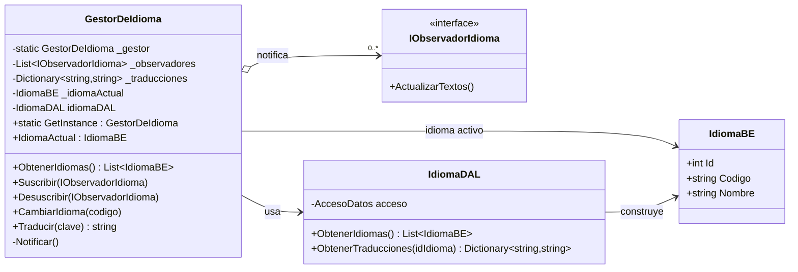
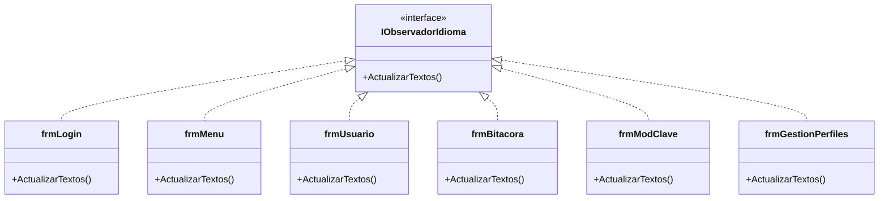
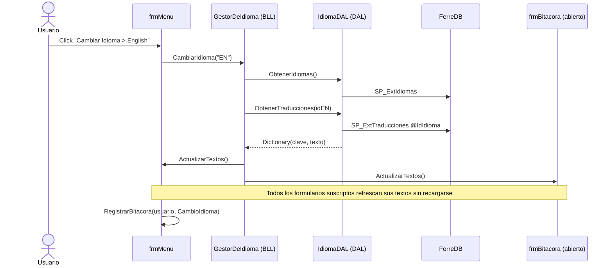
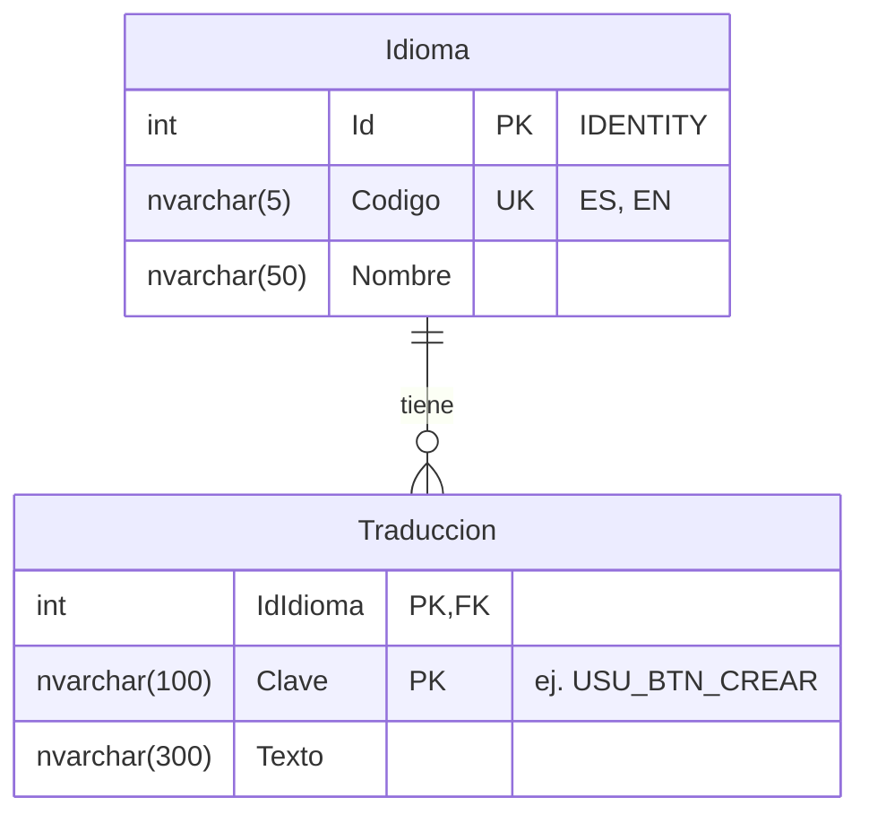

# T05 — Gestión de Múltiples Idiomas (Patrón Observer)

## 1. Requerimiento Funcional No Trivial (RFN)

**RFN5.1 — Cambio Dinámico de Idioma (Observer) — Prioridad: Media**

El sistema permite alternar entre Español e Inglés en toda la interfaz **sin reiniciar la aplicación**. No se utilizan archivos de recursos estáticos (.resx): las traducciones se persisten en un modelo propio en la base de datos (tablas `Idioma` y `Traduccion`) y se aplican mediante el **patrón Observer**: un gestor de idioma (sujeto observable) notifica a todos los formularios abiertos (observadores) cuando cambia el idioma activo, y cada uno refresca sus textos en el momento. Agregar un idioma nuevo consiste en insertar filas en la base de datos, **sin modificar código**.

## 2. Descripción Funcional (DF) por capa

| Capa | Componente | Responsabilidad |
|---|---|---|
| BE (Entidades) | `IdiomaBE` | Entidad idioma: `Id`, `Codigo` (ej. "ES"), `Nombre` (ej. "Español"). |
| DAL (Acceso a Datos) | `IdiomaDAL` | Persistencia: lee los idiomas (`SP_ExtIdiomas`) y el diccionario de traducciones de un idioma (`SP_ExtTraducciones`) devolviéndolo como `Dictionary<clave, texto>`. |
| BLL (Negocio) | `GestorDeIdioma` | **Sujeto observable (Singleton)**. Mantiene el idioma activo, el diccionario de traducciones y la colección de observadores. Expone `Suscribir()`, `Desuscribir()`, `CambiarIdioma(codigo)` — que recarga el diccionario y notifica — y `Traducir(clave)`. |
| Servicios (aspecto técnico) | `IObservadorIdioma` | Interfaz del observador con el método `ActualizarTextos()`. Es infraestructura transversal, igual que `SessionManager`. |
| GUI (Presentación) | `frmLogin`, `frmMenu`, `frmUsuario`, `frmBitacora`, `frmModClave`, `frmGestionPerfiles` | Cada formulario implementa `IObservadorIdioma`, se suscribe en su `Load` (o constructor) y se desuscribe en `FormClosed`. Su `ActualizarTextos()` asigna a cada control el texto de `Traducir(clave)`. |

Detalles de diseño:

- `GestorDeIdioma` sigue el mismo estilo Singleton con doble verificación y `lock` que el `SessionManager` existente.
- Al suscribirse, el observador recibe inmediatamente `ActualizarTextos()`, de modo que un formulario abierto después de un cambio de idioma nace ya traducido.
- `Traducir(clave)` devuelve la clave literal si falta la traducción: los textos faltantes se detectan a simple vista sin romper la aplicación.
- Si la base no está disponible o la migración no fue ejecutada, el gestor degrada de forma segura: la UI conserva los textos de diseño y no se ofrece el cambio de idioma.
- El cambio de idioma se registra en la bitácora con la acción `CambioIdioma` (nuevo valor 14 de `TipoAccion`).
- Los mensajes con datos variables (ej. `"El usuario -->{0}<-- ya tiene la sesion iniciada."`) se resuelven con `string.Format` sobre la traducción.

## 3. Escenario de Caso de Uso (ECU)

**CU: Cambiar idioma con formularios abiertos**

1. El usuario inicia sesión y abre "Bitácora" desde el menú (formulario MDI hijo abierto).
2. Desde el menú **Usuario → Cambiar Idioma**, selecciona **English**.
3. `frmMenu` invoca `GestorDeIdioma.CambiarIdioma("EN")`.
4. El gestor carga desde la BD el diccionario de traducciones del inglés y recorre su lista de observadores llamando a `ActualizarTextos()` en cada uno.
5. El menú, el formulario de Bitácora ya abierto **y también el `frmLogin` oculto** refrescan simultáneamente títulos, menúes, etiquetas, botones y encabezados de grilla ("Bitacora" → "Event Log", "Fecha" → "Date"), **sin cerrarse ni recargarse**.
6. El sistema registra el evento `CambioIdioma` en la bitácora.
7. El ítem del idioma activo queda tildado en el menú.

Flujo alternativo (4a): si la BD no responde, se informa el error de comunicación y la interfaz conserva el idioma vigente.

## 4. Diagrama de clases por capa

### Aspecto técnico (Servicios) + Negocio (BLL)

### Capa de Presentación (observadores concretos)

## 5. Diagrama de secuencia — Cambio de idioma

## 6. Modelo de datos (DER)

- Normalizado en 3FN, con integridad referencial (`FK_Traduccion_Idioma`) y clave primaria compuesta (`IdIdioma`, `Clave`).
- Script: [`Migracion_T05_Idiomas.sql`](../Migracion_T05_Idiomas.sql) (idempotente: crea tablas y SPs si no existen y recarga el diccionario completo ES/EN, ~105 claves por idioma).
- SPs de solo lectura: `SP_ExtIdiomas` y `SP_ExtTraducciones(@IdIdioma)`; sin frameworks de persistencia de terceros.

## 7. Convención de claves de traducción

`PREFIJO_TIPO_NOMBRE` — prefijo por módulo (`LOGIN_`, `MENU_`, `USU_`, `BIT_`, `CLAVE_`, `PERF_`) o `COMUN_` para textos compartidos (Guardar, Cancelar, Salir, confirmaciones, error de BD). Tipos: `LBL` (etiquetas), `BTN` (botones), `GB` (group boxes), `CHK` (checkboxes), `COL` (columnas de grilla), `MSG` (mensajes informativos), `ERR` (errores), `TIT` (títulos de diálogo), `TS` (menúes), `VAL` (validaciones). Los mensajes parametrizados usan `{0}`.

## 8. Alta y mantenimiento de idiomas desde la aplicación (`frmIdiomas`)

Desde **Admin → Idiomas** se abre `frmIdiomas`, que completa el ciclo de vida del modelo:

- **Alta de idioma**: código (máx. 5, se fuerza mayúsculas) + nombre. `GestorDeIdioma.AgregarIdioma` valida datos obligatorios, longitudes y código no repetido (mensajes de error también traducidos), y `SP_CrearIdioma` inserta el idioma **copiando todas las traducciones del idioma base (ES)** como punto de partida: el idioma nuevo es funcional desde el primer momento, sin claves crudas en pantalla.
- **Edición de traducciones**: grilla (Clave de solo lectura, Texto editable) por idioma; al guardar, `GestorDeIdioma.GuardarTraducciones` persiste los cambios (`SP_ActualizarTraduccion`) y, si el idioma editado es el activo, **recarga el diccionario y notifica a los observadores**: las ventanas abiertas reflejan el texto corregido al instante (mismo mecanismo Observer del cambio de idioma).
- Al cerrar el formulario, `frmMenu` rearma su submenú de idiomas, por lo que el idioma recién creado aparece disponible sin reiniciar.
- Bitácora: nuevas acciones `AltaIdioma` (15) y `ModificacionIdioma` (16).
- `frmIdiomas` es también un observador (`IObservadorIdioma`): su propia interfaz se traduce (claves `IDI_*`).
- Script asociado: [`Migracion_T05_AltaIdioma.sql`](../Migracion_T05_AltaIdioma.sql) (SPs `SP_CrearIdioma` y `SP_ActualizarTraduccion` + claves `IDI_*`).

## 9. Balanceo con la implementación

| Elemento del diseño | Implementación |
|---|---|
| `IdiomaBE` | `Entidad_BE/IdiomaBE.cs` |
| `IObservadorIdioma` | `Servicios/IObservadorIdioma.cs` |
| `IdiomaDAL` | `Acceso_DAL/IdiomaDAL.cs` |
| `GestorDeIdioma` | `Negocio_BLL/GestorDeIdioma.cs` |
| Observadores concretos | los 6 formularios de `TP_SanchezVillaverde/` |
| Tablas y SPs | `Migracion_T05_Idiomas.sql` |
| Bitácora del cambio | `TipoAccion.CambioIdioma` (= 14) |

Nota de refactor asociado: `frmUsuario.ClickBoton` comparaba `Button.Text != "Cancelar"`; con textos dinámicos esa comparación se rompía en inglés, por lo que ahora compara contra la referencia del botón (`btnCancelar`).
